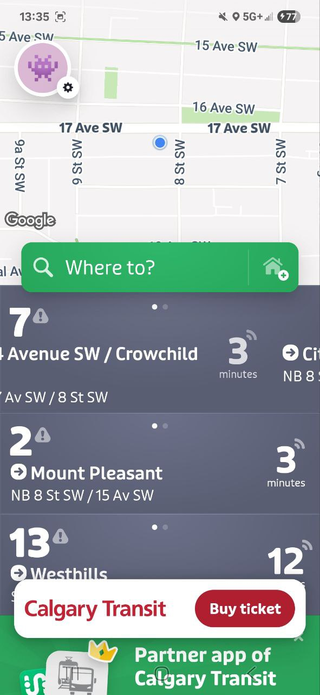
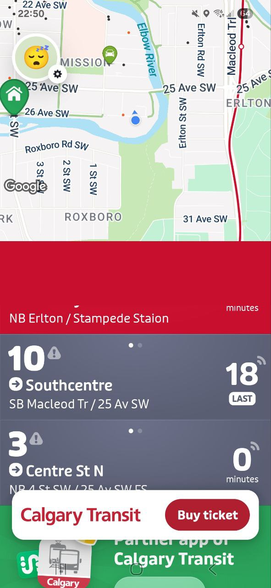

**Title**: Incorrect suggestion when no locations are configured during
work hours

**Steps to Reproduce:**
Ensure that neither "Home" nor "Work" location is configured.
Set device time to 13:00 (within 6 AM -- 2 PM range).

1.  Launch the application.

**Expected Result:**
The app should suggest adding a Work location (according to the rule: if
no locations are configured and current time is between 6 AM -- 2 PM →
suggest Work).

**Actual Result:**
The app suggests adding a "Home" location.

---

**Title:** App suggests adding "Work" location instead of showing route
when saved location is within 600 meters

**Steps to Reproduce:**
Configure Home location within 600 meters of the current geolocation.

1.  Launch the application.

**Expected Result:**
The app should display the travel time to Home.

**Actual Result:**
The app suggests adding a Work location instead.

---

**Title:** Symmetrical issue: Suggests Home instead of showing route
when Work is within 600 meters

**Steps to Reproduce:**
Configure Work location within 600 meters of the current geolocation.

1.  Launch the application.

**Expected Result:**
The app should display the travel time to Work.

**Actual Result:**
The app suggests adding a Home location instead.

